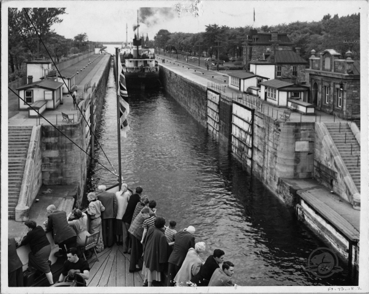

# Parks Canada Sault Ste. Marie Canal National Historic Site

Opened in 1895 as the world's longest lock and the first to be operated by electricity, the Sault Canal completed a national transportation network over 3500 km in length. Traffic through the new system increased steadily and the canal was reaching its peak by 1912, with millions of tons of cargo passing through the lock. The innovative Emergency Swing Dam had proved its worth during the accident of 1909 and a post office had opened in the Administration Building in 1910. A site beautification project was underway by 1911 and the results of this effort can still be enjoyed by visitors today.

- Parks Canada
